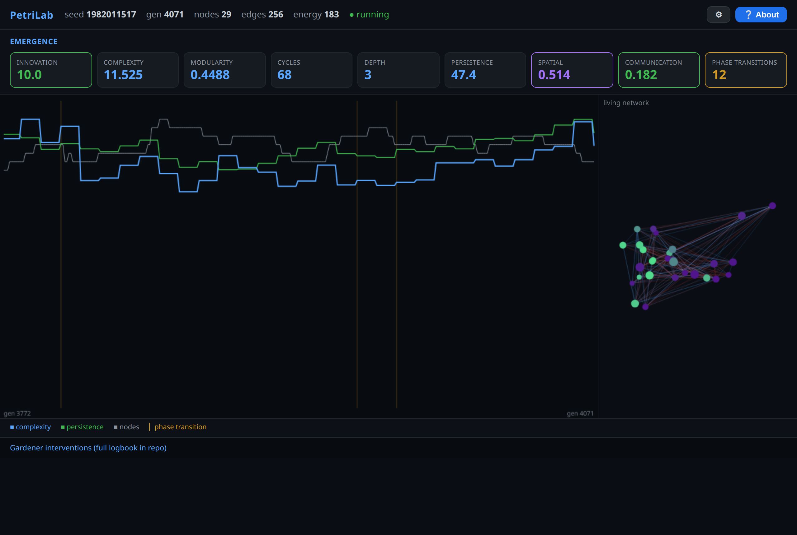

# PetriLab 🧫

**An open artificial-life sandbox where complexity emerges from fixed physics — and an
autonomous research gardener forms hypotheses, runs controlled experiments, and records an
honest evidence chain, unattended.**

Most artificial-life demos show pretty patterns. PetriLab's differentiator is the
**auto-research loop**: a scheduled agent treats the simulation as a laboratory. It proposes
falsifiable hypotheses, tests each one against a control (one mechanism at a time), and logs
both confirmations *and* honest negative results. This repository ships a real evidence chain
of 9 hypotheses produced this way — 6 confirmed, 3 inconclusive.

**Live observatory:** [petrilab.slambert.com](https://petrilab.slambert.com) — public, read-only,
runs unattended. A [scientific preprint](https://petrilab.slambert.com/paper) grounds every
design choice in the open-ended-evolution and edge-of-chaos literature.

*The live dashboard: emergence metrics, a trend graph with phase-transition markers, and the
living network. Fully responsive — desktop and mobile.*

---

## The core idea

A digital petri dish. Cells grow, form connections, and die under **fixed natural laws**.
The rules — the system's "physics" — never change. Only the **conditions** (energy influx,
connection cost, mutation rate, seasons) may be tuned. That single invariant is what makes the
findings valid:

> **Fixed rules, tunable conditions.** If you could change the rules to get a result, you'd
> prove nothing. By freezing the rules and only turning condition-knobs, every confirmed effect
> is a real property of the system, not of the experimenter.

The question we chase: **can a system, under the right conditions, keep evolving forever
instead of settling into a dead equilibrium (homeostasis)?**

---

## What makes it different: the research gardener

An autonomous "gardener" tends the dish on a schedule. It is **not** allowed
to touch the rules or the genome — **level B: it may only tune conditions/ratios.** It:

1. Watches the MODES novelty + complexity trend.
2. When stagnating, proposes an experiment: nudge one condition-knob (energy influx, mutation,
   seasons, season length, signalling), remembering the baseline.
3. Waits an evaluation window, then measures the effect on a composite objective
   (`0.5·novelty + 0.3·complexity + 0.2·ecology`, deliberately not novelty alone, to avoid
   gaming a single axis).
4. Keeps or reverts the change, logging every decision with a reason.

**It learns and remembers.** Each knob carries a durable running estimate of its real effect
(an EWMA), and selection is biased toward knobs that have genuinely helped — so learning
*accumulates* instead of restarting. The gardener's brain and the dish state both persist to
disk and survive restarts. Every 25 experiments it distils its trials into dated conclusions
appended to `data/findings.md`, and emits an explicit **`## ACTION NEEDED`** block when it
concludes it has hit a wall that only an engine change (level A, which it may never make)
could break.

The `research.py` module and the gardener pattern (see [`docs/GARDENER.md`](docs/GARDENER.md))
let you wire it to any scheduler.

---

## Breaking homeostasis: three self-healing mechanisms

The dish is built to resist settling into a dead equilibrium:

- **Seasons** — light influx is modulated cyclically, keeping the selection landscape moving so
  the population cannot "solve" the world and stop (finding H0003: **+375% innovation**).
- **Immigration** — when living lineages fall below a floor, fresh founder lines are injected.
  Pure raw-material injection that never touches selection — the antidote to monoculture collapse
  in long runs. *Diversity, not input volume, is the resource that runs out.*
- **Reheating** — when complexity flatlines, mutation is temporarily raised, then cooled back to
  baseline (simulated annealing with restarts). An explicit remedy for stagnation. Touches only
  variation, never rules or selection.

---

## Results so far

Every finding below was produced by the controlled experiment harness. Negative and
inconclusive results are kept on purpose — that's the point.

| ID | Hypothesis (mechanism) | Primary metric | Effect | Verdict |
|----|------------------------|----------------|--------|---------|
| H0001 | Lower edge cost raises complexity | complexity | **+138%** | ✅ confirmed |
| H0002 | Prune threshold is inactive | complexity | −4% | ⚪ inconclusive |
| H0003 | Seasons (cyclic light) break homeostasis | innovation | **+375%** | ✅ confirmed |
| H0004 | Endogenous selection raises post-shock recovery | recovery | **+3.7%** | ✅ confirmed |
| H0005 | Catastrophes alone don't raise lasting innovation | innovation | −25% | ⚪ inconclusive |
| H0006 | Chemotaxis (phase 1) → cells self-organize into tissue | spatial | **+175%** | ✅ confirmed |
| H0007 | Bias heredity (phase 2 v1) raises persistence | persistence | −0.5% | ⚪ inconclusive |
| H0008 | **Structural** heredity (phase 2 v2) raises complexity | complexity | **+27%** | ✅ confirmed |
| H0009 | Signaling molecules (phase 3) raise innovation | innovation | **+233%** | ✅ confirmed |

**The key insight** came from a *failure*: H0007 (inheriting a single bias scalar) did nothing,
but H0008 (inheriting the mother cell's **connection pattern**) worked. Information lives in the
*connections*, not in the cells. That reframing drove the whole phase-2/phase-3 design.

Full evidence chain with timestamps and thresholds: [`RESULTS.md`](RESULTS.md).

---

## Quickstart

Requires Python 3.11+.

    git clone https://github.com/slambertdk/petrilab.git
    cd petrilab
    python3 -m venv .venv
    source .venv/bin/activate
    pip install -r requirements.txt
    ./run.sh

Then open **http://localhost:8770** in your browser. The dashboard is fully responsive
(desktop + mobile) and has a built-in **About** overlay explaining every metric.

### Run a controlled experiment yourself

Reproduce a confirmed finding from the command line:

    .venv/bin/python experiment.py

### Drive the research module

    .venv/bin/python research.py --help

---

## Architecture

| File | Role |
|------|------|
| `v2/petrilab.py` | **The live engine.** Deterministic, seeded, reproducible. Cells with variable-length genomes, lineages, an open genotype, and the three self-healing mechanisms (seasons, immigration, reheating). State persists across restarts. |
| `v2/gardener.py` | **The autonomous experimenter.** Level-B: tunes only conditions, never rules/DNA. Durable per-knob learning (EWMA), dated conclusions to `data/findings.md`, `ACTION NEEDED` escalation. Brain persists across restarts. |
| `v2/modes.py` | MODES-style measurement over persistent lineages (change, novelty, ecology, complexity) + a three-condition falsification contract that can declare the run a failure. |
| `v2/server.py` + `v2/dashboard.html` | The live **Observatory**: petri view, MODES axes, falsification verdict, the Gardener loop, live-viewer count. Serves `/paper` (the preprint) and `/deck`. Fully responsive. |
| `engine.py`, `metrics.py`, `experiment.py`, `research.py`, `server.py` | Legacy v1: the original engine, metric grid, experiment harness and dashboard that produced the H0001–H0009 evidence chain. Kept for reference and reproducibility. |

See [`docs/RESEARCH.md`](docs/RESEARCH.md) for the full research design and
[`docs/GARDENER.md`](docs/GARDENER.md) for the auto-research how-to.

---

## Design principles

- **Reproducible.** Same seed = same run. Every experiment can be repeated.
- **Honest science.** Negative results stay in the record.
- **One mechanism at a time.** Each feature is tested in isolation against a control.
- **Fixed rules.** The engine's laws are frozen; only conditions vary.

---

## License

MIT © Henrik Lambert. See [`LICENSE`](LICENSE).

This is a research artifact, released so others can read, run, fork, and build on it.
If it's useful in your own work, a citation or a link back is appreciated.
